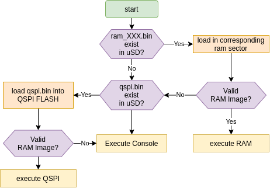

# H7 Boot

STM32H7 bootloader tinking in H750 value line with only 128K of flash

The bootloader load programs from SDMMC1@1bit to QSPI Interface2 and check the QSPI firmware validity.

If cannot boot from uSD or QSPI, the monitor start a console in USART1 (PA9/PA10)

## Boot sequence

